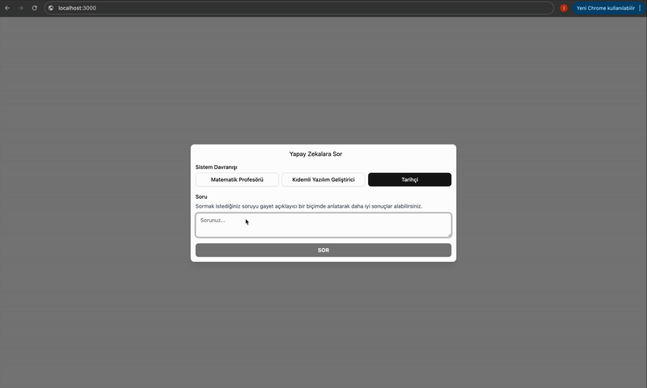
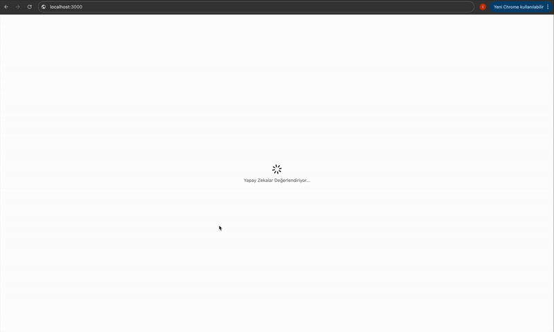
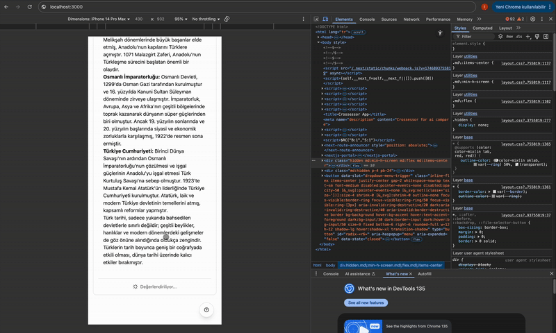

# Crossessor 🤖

Crossessor, farklı yapay zeka modellerinin aynı soruya verdikleri cevapları karşılaştırmalı olarak değerlendiren, **Semantic Kernel** altyapısında dallanan modern bir web uygulamasıdır.

## 🎯 Amaç

Crossessor, yapay zeka modellerinin performansını karşılaştırmalı olarak analiz etmeyi amaçlar. Kullanıcılar:

- Aynı soruyu farklı AI modellerine sorabilir
- Modellerin cevaplarını yan yana görebilir
- Modellerin birbirlerini nasıl değerlendirdiğini inceleyebilir
- Her modelin cevabının doğruluk, eksiksizlik, netlik ve tarafsızlık açısından puanlamasını görebilir

## ▶ Ön Gösterim





## 🛠️ Teknolojiler

- **Frontend**: Next.js 15.3.1, React 19, TypeScript
- **UI Framework**: Shadcn UI, Tailwind CSS
- **Form Yönetimi**: React Hook Form, Zod
- **Markdown Render**: React Markdown
- **HTTP Client**: Axios
- **State Management**: React Hooks
- **Backend**: .NET Core 8 Web Api, PostgreSQL
- **Mimari**: Vertical Slice Arhitecture, MediatR, CQRS Pattern
- **Yapay Zeka Araçları**: Semantic Kernel

### Özellikler

1. **Soru Sorma**
   - Sistem davranışı seçimi (Matematik Profesörü, Kıdemli Yazılım Geliştirici, Tarihçi)
   - Markdown destekli soru girişi
   - Responsive tasarım

2. **Cevap Karşılaştırma**
   - Desktop: Yan yana karşılaştırma
   - Mobil: Seçimli görüntüleme
   - Markdown render desteği

3. **Çapraz Değerlendirme**
   - Modellerin birbirlerini değerlendirmesi
   - Doğruluk, eksiksizlik, netlik ve tarafsızlık puanlaması
   - Genel puan hesaplama

## 🚀 Başlangıç

```bash
# Bağımlılıkları yükle
npm install

# Geliştirme sunucusunu başlat
npm run dev
```

## 📱 Responsive Tasarım

- **Desktop**: İki sütunlu grid yapısı
- **Mobil**: Tek sütun, seçimli görüntüleme
- **Tablet**: Responsive grid yapısı

## 🔄 İş Akışı

1. Kullanıcı soru sorar ve sistem davranışını seçer
2. Seçilen AI modelleri cevap verir
3. Kullanıcı cevapları karşılaştırmalı olarak görüntüler
4. Çapraz değerlendirme başlatılır
5. Her model diğerinin cevabını değerlendirir
6. Değerlendirme sonuçları görüntülenir

## 🎨 UI/UX Özellikleri

- Modern ve temiz arayüz
- Yükleme durumları için animasyonlar
- Markdown desteği
- Responsive tasarım
- Kolay gezinme
- Sezgisel kullanıcı deneyimi

## 🔜 Gelecek Özellikler

- Daha fazla AI modeli desteği
- Detaylı analiz raporları
- Kullanıcı hesapları ve geçmiş
- Özelleştirilebilir değerlendirme kriterleri